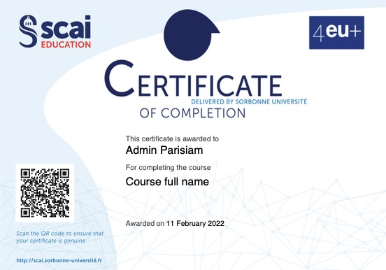
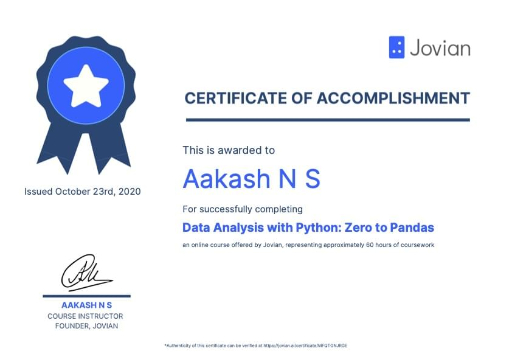
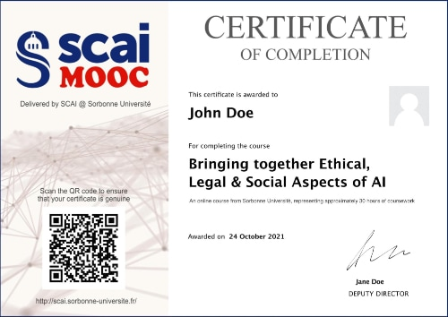
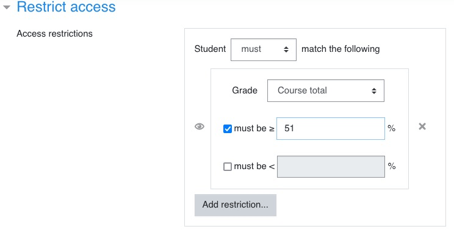
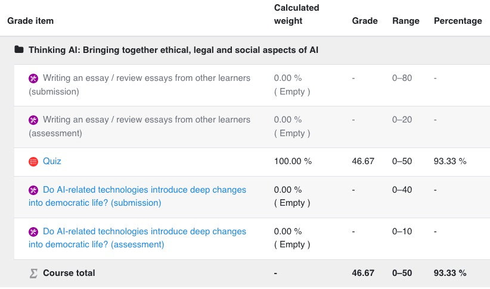

<h1>CERTIFICATE</h1>

[TOC]

# Content of the certificate

# Plugins to install

The certificate/diploma consists in **two plugins**:

- https://moodle.org/plugins/tool_certificate (/admin/tool/certificate) to generate the certificate template.
- https://moodle.org/plugins/mod_coursecertificate (/mod/coursecertificate) to emit the certificate. The certificate is added as an **activity** to a course.

# About security

The certificate can be secured through several mechanisms that can be simultaneously applied: **code, QR code, digital signature**.

The digital signature works through a `.ctr` file. Se: https://docs.moodle.org/311/en/Certificate_templates

>  ATTENTION to regenerate a proper certificate on the production server.

# Resources

- https://docs.moodle.org/311/en/Certificates
- https://docs.moodle.org/311/en/Course_certificate_activity
- https://youtu.be/WQeL9mQJMj0

# Examples of certificates

# Bugs

Un certificat a été obtenu par un étudiant qui n'a passé que le Quiz et dont l'essai (toujours en phase de soumission) n'a pas été évalué. La condition d'obtention du certificat était d'avoir un nombre de point supérieur à 51**%** (et non 51 points). 

Or voilà le rapport de l'étudiant. Il obtient 93%.

Le calcul du % ne tient pas compte de l'essai. On ne peut donc pas utiliser cette méthode pour valider le certificat, il faut en passer par la validation des activités.
