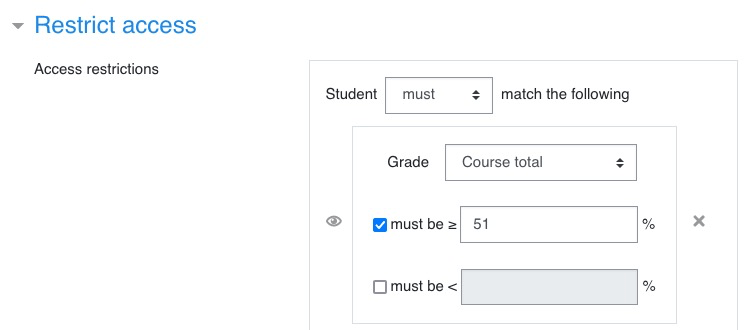
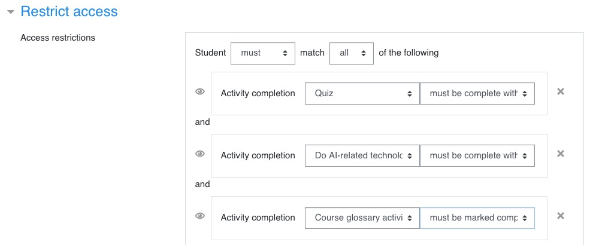
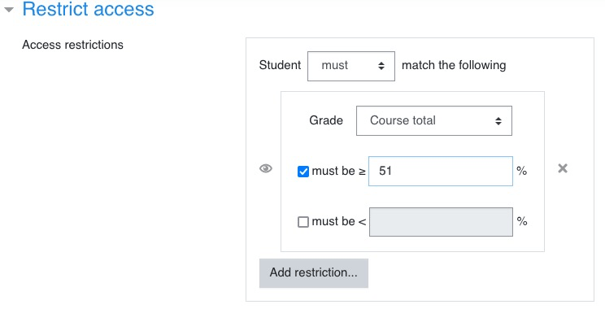
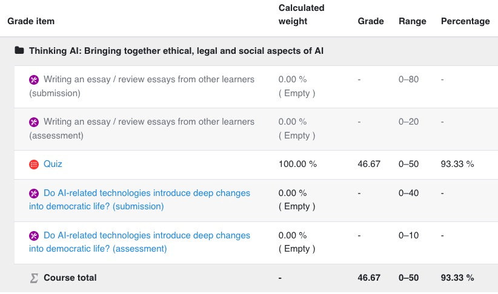

<h1>STRATEGIES D'OBTENTION DU BADGE ET DU CERTIFICAT</h1>

Ce document explique les deux stratégies d'obtention du badge et du certificat dans Moodle et les choix qui ont été faits.

[TOC]

# Introduction

Pour obtenir un badge ou un certificat, il faut que les étudiants réunissent certaines conditions (completion) et parfois obtiennent un certain nombre de points (grade). Les conditions à remplir et le nombre de points 

Rappel de certaines notions:

- Les étudiants obtiennent des **notes** ou **marks** (qui peuvent être numériques ou non) au niveau des activités. Ces notes sont converties en **points** ou **grades** qui eux sont toujours numériques. 
- Les **points** ou **grades** obtenus pour toutes les activités d'un cours sont cumulées. 
  - Pour certaines activités, on peut définir (ou pas) un seuil de points en deça duquel l'étudiant échoue à cette activité.
- On peut également définir (ou pas) un seuil de points en deça duquel l'étudiant échoue au cours.
- Certaines activités ne génèrent pas de points (par exemple, ajouter une définition au glossaire).

Pour valider un cours (et obtenir un badge ou un certificat), on peut utiliser deux stratégies qui présentent chacune un intérêt différent. Il faut garder en tête que lors du fonctionnement du site, l'activité de workshop (essai) va nécessiter de régulièrement créer des workshops et en créer des nouveaux (le même workshop ne peut pas être utilisé tout au long de la vie du Moodle). Ceci peut entrainer une maintenance importante du site.

Le term utilisé dans Moodle pour valider un cours ou une activité est **completion** (activity completion, course completion).

# Points gagnés par activité

Voici la répartition des points gagnés pour chaque activité. J'ai fait en sorte que le nombre de points maximum qu'un étudiant puisse gagner sur le cours soit de **100**.

| Activité               | Max. de points pour l'activité | Min. de points pour valider l'activité |
| ---------------------- | ------------------------------ | -------------------------------------- |
| Essai                  | 50                             | 25                                     |
| - *Rédaction et dépôt* | *40 (80%)*                     | *20*                                   |
| - *Evaluation*         | *10 (20%)*                     | *5*                                    |
| Quiz                   | 50                             | 25                                     |
| Glossaire              | -                              | -                                      |
| **Total**              | **100**                        | **50**                                 |

A noter : Essai et Quiz ont la même importance relative.

Lorsqu'on aura à utiliser le nombre de points minimum pour **valider un cours (course completion)**, il faudra utiliser plus de 50 points (51 par exemple). Sinon, il suffira que l'étudiant réussissent le Quiz pour valider le cours sans avoir à déposer son essai.

# Stratégie 1

**Dans cette stratégie, on va utiliser les points (ou grades) à tous les niveaux (activités et cours). C'est la stratégie la plus souple, mais elle fait l'impasse sur le glossaire.**

## Obtention du badge

Les conditions d'obtention d'un badge sont définies lors de la création du badge. On choisit ici l'obtention via le cours (**course completion**).

On indique ici le nombre minimal de points à obtenir au niveau du cours pour avoir son badge. Pour que cela fonctionne, il faut avoir au préalable renseigné les conditions de réalisation "completion" au niveau du cours lui-même.

**Rappel : Dans ce cas de figure, il faut noter que le glossaire n'est pas pris en compte car aucune note n'est attribuée pour le renseigner.**

## Obtention du certificat

Le certificat a un fonctionnement différent du badge : il se présente sous la forme d'une **activité** qu'on ajoute à un cours. 

On n'indique donc pas de condition de réalisation de cette activité (activity completion), mais des **restrictions d'accès** (**restrict access**). On choisit ici la condition sur le minimum de points à obtenir :

### 

A noter ici, **la valeur indiquée (51) est un pourcentage**. Pour rester cohérent avec le badge, il faut soit ajuster ce %, soit indiquer également 51 points au niveau du badge tout en s'assurant que le total que peut gagner un étudiant est au maximum 100 points pour le cours.

## Validation du cours (course completion)

# Stratégie 2

## Obtention du badge

Les conditions d'obtention d'un badge sont définies lors de la création du badge. On choisit ici les activités. On peut donc inclure le quiz, l'essai (workshop) et le glossaire.

Attention : Les conditions de chaque activité doivent avoir été définies au sein de chaque activité dans la rubrique Activity completion:

- Quiz : avoir terminé au moins une fois le quiz et avoir obtenu une note suffisante.
- Workshop : avoir au moins soumis l'essai (par forcément les évaluations).
- Glossaire : avoir au moins renseigné 1 entrée.

## Obtention du certificat

Le certificat a un fonctionnement différent du badge : il se présente sous la forme d'une **activité** qu'on ajoute à un cours. On n'indique donc pas de condition de réalisation de cette activité (activity completion), mais des **restrictions d'accès** (**restrict access**).

### Obtention via les activités (activity completion)

  

# Conditions

- L'essai (appelé workshop dans Moodle), le quiz et le glossaire sont des activités dans Moodle (activité = l'étudiant interagit avec Moodle - et éventuellement, mais pas nécessairement ses pairs).
- Imaginons qu'on crée un Workshop 1 : pour pouvoir donner une note à un étudiant dans le Workshop 1, il faut le clôturer ("close").
- Mais une fois le Workshop 1 clôturé, les nouveaux étudiants ne peuvent plus s'y inscrire. En fait, les étudiants ne peuvent plus s'inscrire au Workshop 1 dès qu'on le passe en phase Assessment, donc bien avant la phase de clôture (les phases sont : submission > assessment > grading > closing).
- Pour qu'il n'y ait pas d'interruption dans le fonctionnement du cours, il faut donc que dès que le Workshop 1 passe à la phase Assessment, on ouvre automatiquement un nouveau Workshop 2 (sinon, il y aura une période de temps pendant laquelle les étudiants ne pourront pas rédiger et soumettre d'essai).
- Maintenant, pour valider un cours et attribuer un badge et un certificat, il faut :
  - Solution 1 : Soit se baser sur la validation d'activités indiquées **nommément** (Quiz, Workshop **1**, Glossaire)
  - Solution 2: Soit se baser sur une **note globale** : total des notes obtenues, toutes activités confondures, sachant qu'on ne peut attribuer de note au glossaire.*

Chaque solution a ses failles.

**Les failles de la solution 1**

- Un même étudiant peut finalement soumettre plusieurs essais : rien ne lui interdit de soumettre son essai dans le workshop 1, puis le Workshop 2, etc.
- Cette solution impose aussi de créer un nouveau badge et un nouveau certificat dans Moodle pour chaque Workshop car il faut redéfinir à chaque fois les conditions de validation en désignant les Workshops au fur et à mesure de leur création. Cela demande un travail supplémentaire à l'administrateur.
- Un même étudiant peut aussi obtenir plusieurs badges et plusieurs certificats s'il participe aux workshops successifs.

**Les failles de la solution 2**

- Si un étudiant n'a pas assez de points pour obtenir son badge et son certificat, il lui suffit de resoumettre un essai dans un Workshop suivant et à force de cumuler des points, il finira par passer la barre.

**En fait si, mais seulement si une note est attribuée manuellement à au moins une entrée de l'étudiant ce qui oblige soit l'admin soit un autre étudiant à la donner ce qui représente une trop grande contrainte.*

# Bugs ou problèmes constatés

## Plugin du certificat

Un certificat a été obtenu par un étudiant qui n'a passé que le Quiz et dont l'essai (toujours en phase de soumission) n'a pas été évalué. La condition d'obtention du certificat était d'avoir un nombre de point supérieur à 51**%** (et non 51 points). 

Or voilà le rapport de l'étudiant. Il obtient 93%.

Le calcul du % ne tient pas compte de l'essai. On ne peut donc pas utiliser cette méthode pour valider le certificat, il faut en passer par la validation des activités.

## Activité workshop (essai)

Cette activité est buguée (Moodle 3.11). Impossible de caler la validation de l'essai sur la phase d'évaluation. On ne peut que caler sur la phase de soumission. Un essai sera donc considéré comme terminé même si l'étudiant n'a pas fait lui-même d'évaluation (il faudra cependant que son essai soit évalué pour qu'il obtienne une note).