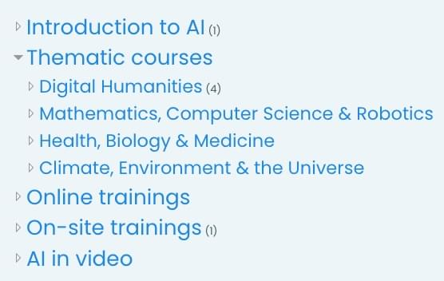
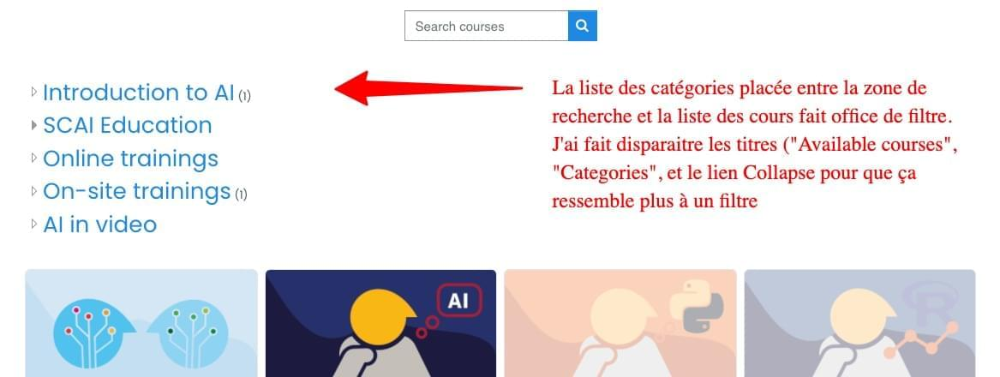

<h1>FRONT PAGE</h1>

[TOC]

# Introduction

Moodle est un LMS. Contrairement aux CMS habituels (Joomla, Wordpress...), il est difficile d'ajouter de simples pages de contenu accessibles par un menu. En revanche, Moodle gère très bien les cours et leurs activités. Chacun a sa spécialité.

Le page d'accueil est le seul endroit en dehors des cours où on peut ajouter un peu de contenu librement (malgré une structure assez rigide). Son contenu peut aussi être différent selon que l'utilisateur est connecté ou non, et selon son type (étudiant, professeur, admin...).

Le vocabulaire de Moodle peut être assez confus :

- **Front page, Site home, Home page, Home** : tous ces termes désignent la page d'accueil.
- En revanche, la page appelée **Dashboard** n'est PAS la page d'accueil mais une autre page de type "tableau de bord". Le Dashboard n'est accessible qu'aux utilisateurs connectés.

Afin d'éviter la confusion, le paramétrage de Moodle a été ajusté pour qu'une fois logué l'utilisateur soit redirigé vers la page d'accueil au lieu du Dashboard, qui est la redirection par défaut de Moodle.

Le slider est également affiché à la fois aux utilisateurs connectés et non connectés.

# Structure de la page

On peut choisir par paramétrage de faire apparaitre un certain nombre de rubrique sur la page d'accueil de Moodle, en plus du slider et du texte de présentation qui le suit :

- Liste des catégories (optionel)
  
- Zone de recherche (optionel)
  
- Liste des cours (optionel) - Voir image plus bas.

Ces trois rubriques sont optionelles et peuvent être affichées dans l'ordre qu'on souhaite.

# Améliorer l'ergonomie

Afin d'améliorer l'ergonomie de la page d'accueil j'ai présenté les choses comme suit :

Mais idéalement on aimerait pouvoir utiliser les tags plutôt que les catégories.

# Comment aller plus loin ?

Une idée serait de pouvoir utiliser les mot-clés directement sur la page d'accueil, possiblement à la place des catégories dans la copie d'écran ci-dessus. 

Malheureusement Moodle ne propose pas cette fonctionnalité en standard, ni sous la forme de plugin. Il faut faire des recherches, voir si c'est possible et si oui, comment modifier le theme en conséquence.

# Ordre des cours dans la liste des cours

On ne peut pas complètement contrôler l'ordre dans lequel apparaissent les cours sur la page d'accueil (je suis aller regarder dans le code) :

- On ne contrôle l'ordre des cours que partiellement et **uniquement à l'intérieur d'une catégorie**.

- Mais on peut contrôler l'ordre d'apparitions des catégories.

Voici un exemple : pour pouvoir mettre le cours Elements of AI avant les autres, il m'a fallu :

1. Créer une nouvelle catégorie : "Introduction to AI".

2. Déplacer le cours *Elements of AI* dedans.

3. Mettre cette catégorie "Introduction to AI" en premier parmi la liste des catégories.

Si on rajoute d'autres cours dans cette catégories, ils apparaitront aussi avant Thinking AI.
