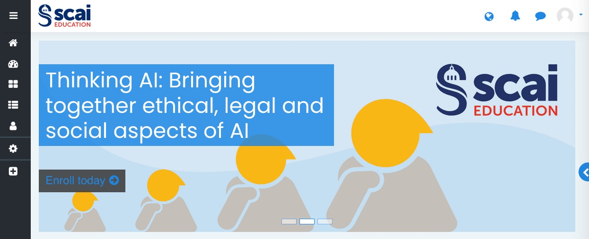
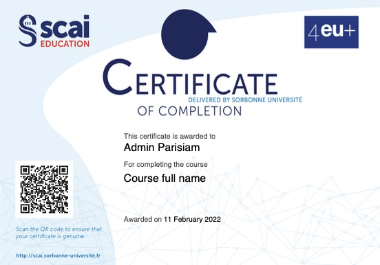

<h1>GRAPHIC DESIGN</h1>

Ce document sert à définir les contraintes sur les images à insérer dans le Moodle.

[TOC]

# Notes préliminaires

- Afin d'optimiser les temps de chargement et à chaque fois que ce sera possible, j'utilise à priori les images au format **jpeg** et les passe par un optimiseur afin de réduire leur poids au maximum. Je ne garde des images au format **png** qu'en cas de besoin de **transparence** sur certaines parties de l'image ou si leur poids est inférieur aux images **.jpeg**.
- J'utilise des images en **72 dpi**.
- Certaines images ont besoin d'être changées au cours de temps (celles avec les tampons "Coming Soon" par exemple). Il faut donc fournir **plusieurs images**.

Ça peut-être plus simple de me fournir les fichiers .psd/,ai plutôt que les images jpeg ou png du fait de ces transformations.

PS: j'utilise la suite Affinity et non Adobe (mais c'est en principe compatible).

# Couleurs du Moodle

Pour les couleurs, j'ai utilisé le **rouge** (**#E01207**) et le **bleu** (**#102970**) SCAI.

Le thème du Moodle ajoute aussi un **bleu clair** (**#1e88e5**) que l'on voit par exemple sous les textes dans le slider ou dans les vignettes de leçons.

# Logo du Moodle

**Dimensions 500 x 245, 72 dpi.**

# Vignette des cours

**Dimension 450 x 250, 72 dpi.**

Chaque cours a sa propre vignette

Attention, certaines images pourraient avoir besoin en plus de :

- Un drapeau de langue
- Un tampon "Coming Soon"
- Un tampon "Partner" pour les cours proposés par des établissements partenaires
- Un tampon indiquant la date, par exemple "Paris, June 2022"

On a également une image "blanche" (cad vide ou avec des motifs géométriques, mais dans le style, pour les cours génériques ou n'ayant pas encore d'image dédiées).

# Le slider

**Dimension 1400 x 500, 72 dpi.**

Il ne faut pas mettre de texte tout au moins dans toute la partie gauche (75% de l'image) car le texte est amené par le Moodle de façon dynamique.

On a également une image "blanche" (cad vide ou avec des motifs géométriques, mais dans le style, pour les slides génériques).

# Page d'un cours

Pour avoir accès à cette page, il faut être connecté. Seul le cours Thinking AI contient la structure indiquée ici.

**Dimensions de chaque vignette 360 x 240, 72 dpi.**

On le voit, les images peuvent être recouvertes par le texte mis par Moodle :

- Titre de la leçon (en haut à gauche). Ex: AI & epistemology
- Avancement (en bas à gauche). Ex : Progress 0/1
- Restrictions (en bas à droite). Ex: Restricted

# Page d'une leçon

Pour chaque leçon, je réutilise simplement sa vignette utilisée dans la page du cours, en grande plus taille (500 x 333), mais idéalement, une image un peu plus rectangulaire serait plus élégante.

Il est en réalité possible d'intégrer toutes sortes d'images sur les pages des leçons (mais cela n'est possible qu'en dessous du titre de la leçon et non au-dessus comme envisagé à un moment).

# Badge

**Dimensions 400 x 400, 72 dpi.**

Le badge est carré mais le plus souvent une forme circulaire est représentée sur fond transparent. 

La forme des badges est libre, mais les éléments que le badge doit contenir sont :

- Le ou les logos des organismes qui le délivrent (Sorbonne Université, 4EU+...).
- Le nom du cours (prévoir suffisamment de place).
- Un emplacement pour indiquer un niveau ou une progression (des étoiles par exemple).
- Un badge peut être donné à plusieurs niveaux (une leçon, un cours, un ensemble de cours…).

Il est possible de créer un badge ou de recupérer des formes ici :[https://badge.design](https://www.google.com/url?q=https://badge.design/&sa=D&source=editors&ust=1645361276076058&usg=AOvVaw3X7dXzbSmRNWKCJHtmW6bc) (cliquer sur Design assets).

# Certificat

**Dimension format A4 paysage (29,7 cm x 21 cm).**

Un document au format vectoriel permet d'extraire le fond du document car lors de l'émission du certificat Moodle crée un fichier PDF à partir de plusieurs éléments (image de fond, textes variables, QR code unique généré spécifiquement pour chaque certificat...)

Il faut penser que le document pourra être imprimé, c'est probablement mieux d'éviter les fonds foncés.

