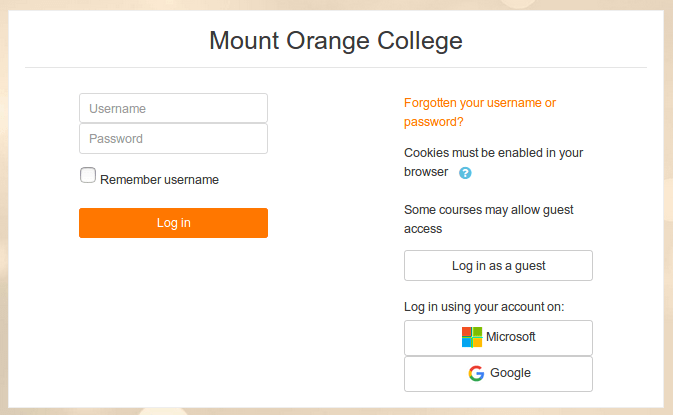

<h1>INSTALLATION</h1>

This file contains the steps to follow when installing the Moodle. Attention, not all the steps are mentioned and some of them are no longer used, but it gives a pretty good idea of what's going on.

[TOC]

► https://docs.moodle.org/311/en/Installing_Moodle

# Server settings

## Https

Once the files are on the server, start the installation process with the `https://` link, i.e. https://moodle.parisiam.com. Check the **config.php** file and make sure wwwroot has **https** in place and not http:

```php
$CFG->wwwroot = 'https://moodle.parisiam.com';
```

That seems to be enough to force https.

By security, I add an .htaccess file:

```sh
RewriteEngine On
RewriteCond %{SERVER_PORT} 80
RewriteRule ^(.*)$ {SERVER_NAME}/$1 [R,L]
```

## Database collation

Don't forget to set the collation of the database to **utf8mb4_unicode_ci** BEFORE starting the installation. Check the **config.php** file:

```php
'dbcollation' => 'utf8mb4_unicode_ci'
```

# Moodle Settings

## Available languages

### Language packs

Find **Language packs** in Site Administration and import the language(s).

### Default language

Open the *Administration / Language* category to adjust the default language.

## Multilingual filter

To enable multilingual dropdowns and labels:

- Find **Manage filters** in Site Administration and set **Multi-Language Content** filter on and choose **Content and Headings** option.
- In fields definitions, dropdown options, etc... indicate the different languages with a `<span>` as below:

```php
<span class="multilang" lang="en">Other</span><span class="multilang" lang="fr">Autre</span>
```

> This technique is used for the **custom profile fields**, the **front page**....

Attention: this may slow down the site as every single page is scanned for the language tag.

## Language menu

To avoid displaying English and French in the language menu and replace it by a shorter version (EN, FR).

> Note: I couldn't find how to show flags.

Search **langlist** in Site administration and put these values (with Moove plugin, I choose not to use it):

```
en|EN,fr|FR
```

## Outgoing mail configuration

Search **outgoingmailconfig** in site administration.

► https://docs.moodle.org/311/en/Mail_configuration

**<u>Using a server:</u>**

| Setting                       | Value                       | Comment                                                |
| ----------------------------- | --------------------------- | ------------------------------------------------------ |
| SMTP hosts (smtphosts)        | ampro4.fcomet.com           |                                                        |
| MTP security (smtpsecure)     | TLS                         |                                                        |
| SMTP Auth Type (smtpauthtype) | PLAIN                       |                                                        |
| SMTP username (smtpuser)      | noreply@moodle.parisiam.com | An email account had to be<br />created on the server. |
| SMTP password (smtppass)      | qsx#vxNW#hGk                |                                                        |

**<u>Using MailJet:</u>**

| Setting                       | Value                            | Comment |
| ----------------------------- | -------------------------------- | ------- |
| SMTP hosts (smtphosts)        | in-v3.mailjet.com                |         |
| MTP security (smtpsecure)     | TLS                              |         |
| SMTP Auth Type (smtpauthtype) | PLAIN                            |         |
| SMTP username (smtpuser)      | 27ac3ca5104e295eb179660728f91cab |         |
| SMTP password (smtppass)      | e04e9228e18b8f52da184059c6e5aaed |         |

Testing : https://moodle.parisiam.com/admin/testoutgoingmailconf.php

## Password policy

Find **Security** in site administration:

- Check the **Password policy** (*passwordpolicy*) field.
- Adjust the corresponding fields.

### No-reply

Search **noreplyaddress** in site administration and setup a proper no-reply address. The default is based on the url of the Moodle, i.e. noreply@moodle.parisiam.com.

# Add custom fields in user's profiles

Personalize the registration form by adding custom fields (checkboxes, free texts, dropdowns...).

Search **User profile fields** in site administration. Or go to Administration > Users > Accounts > User profile fields

Documentation : https://docs.moodle.org/311/en/User_profile_fields

# Cron

## 1. Testing

Find **Security** in site administration:

- Uncheck **Cron execution via command line only** (*cronclionly*).
- Find the **Cron password for remote access**  (*cronremotepassword*) field and set a password.
- Run https://moodle.parisiam.com/admin/cron.php?password=mypassword in the browser
- Check **Cron execution via command line only** (*cronclionly*) once testing is over.

## 2. Setup the server

In CPanel (or the available tool), setup the frequency to ==**1 min**==. if possible, at most 30 min for:

```
/usr/local/bin/php /home/schedulo/moodle.parisiam.com/public_html/admin/cli/cron.php
```

> Note that this is the CLI version of the cron (.../cli/cron.php)

If the server dow not allow to setup cron or if the maximum frequecy is to low, it is possible to use an external services such as https://cron-job.org or https://webcron.talent-factory.ch (in German).

► https://docs.moodle.org/311/en/Cron

# Initial values

## Categories

It is first necessary to identify and create **categories** i.e. Science, Literature... and **sub-categories** (i.e. Chemistry, Biology... for Science).

- Mathematics, Computer Science & Robotics (mathématiques-informatique-robotique)
- Health, Biology & Medicine (santé-médecine)
- Climate, Environment & the Universe (climat-environnement-Univers)
- Digital Humanities (humanités numériques)

# Users

## Settings

Go to Plugins > Authentication > **Manage authentication** and check the **Allow log in via email** option.

## Import users using CSV file

Search and open **Upload users** in site administration.

https://www.fakenamegenerator.com/order.php

Compulsory fields: `username,firstname,lastname,email` (no space after commas)

Optional fields: password

Optional fields: `course1,role1,group1,cohort1`

- Course and cohort must already have been manually created
- For roles: student, editingteacher (for teacher)

► https://docs.moodle.org/311/en/Upload_users

## User self-registration

Find **Manage Authentication** in Site administration:

- Activate the **Email-based self-registration** plugin.
- Choose the value "*Email-based self-registration*" for the **Self registration** field.

Possible to use Re-Captcha.

It is possible to manually confirm the new users if they didn't receive the confirmation email.

- Check **Prevent account creation when authenticating** (authpreventaccountcreation).
- Set **Guest login button** (guestloginbutton) to *Hide*.

## Hide some Moodle features using local_boostnavigation

**Boost navigation fumbling** plugin adds an extra navigation to have a Courses menu on the sidebar :
► https://moodle.org/plugins/local_boostnavigation and https://fontawesome.com/v4.7/icons/

### Competencies

Search **competencies** and **learning plan** keyword in Site administration and remove all competencies settings (don't forget to lock the settings, when available).

### Calendar

Search **calendar** keyword in Site administration and remove all competencies settings (don't forget to lock the settings, when available): **removecalendarnode** and **disabledfeatures** (for mobile).

### Private files

Hide Private files root node: Search **removeprivatefilesnode** keyword in Site administration and check the option. Select all related options in **disabledfeatures** setting.

### Content bank

Hide Content bank root node: Search **removecontentbankcoursenode**  and **removecontentbanknoncoursenode** keywords in Site administration and check the option. 

### Courses shortcuts for all users

Search for **insertcustomnodesusers** (in Appearance > Boost navigation fumbling > Custom root nodes) and add:

```
All Courses|/course/index.php||||||fa-th-large
```

### Courses and users shortcuts for admin

Search for **insertcustombottomnodesadmins** (in Appearance > Boost navigation fumbling > Custom bottom nodes) and add:

```
Manage courses|/course/management.php?view=courses||||||fa-th-list
Manage users|/admin/user.php||||||fa-user
```

```
See why this is not working:
Courses|||||||fa-folder-open
-Edit|/course/management.php?view=courses
-View|/course/index.php
```

## Remove guest login

Go to Site administration > Plugins > Authentication > Manage authentication and set **guestloginbutton** to Hide.

# Themes

Find **Plugins** in site administration and click install a new plugin.

## Moove (customized)

In **bannerhtml** (no editor zone):

```html
<div class="d-flex justify-content-around">
    
</div>
<h1 class="text-center">Welcome to the SCAI<br>free online courses!</h1>
```

## Boost (not used now)

#### Adjust SCSS in settings

Boost theme uses SCSS and Moodle has an SCSS compiler integrated.
► https://docs.moodle.org/dev/SCSS

For quick changes, search **themesettingboost** in site administration, click on **Advanced settings** and set SCSS variables in theme_boost | scsspre (Raw initial SCSS) and SCSS declarations in theme_boost | scss (Raw SCSS).

#### Add a customized SCSS file

I didn't (switched to Moove template).

# ATTO editor

In site administrator > Plugins > Text editors > Atto HTML editor > Atto toolbar settings (or search for **editoratto**).

- Add **fontcolor** and **backcolor** to Toolbar config (**editor_atto | toolbar**).

## atto_pastespecial plugin (removed)

► https://moodle.org/plugins/atto_pastespecial

Download and install the plugin, then add **pastespecial** to Toolbar config (**editor_atto | toolbar**).
Note: I removed it. it wasn't updated for many years and would have needed a review of the design (old BS version I think).

# Certificates and diplomas

Install the following plugins:

- https://moodle.org/plugins/tool_certificate : This plugin allows users to create certificate templates on the system and course category levels.
- https://moodle.org/plugins/mod_coursecertificate : issues certificates.

It is possible to secure a certificate with a digital signature. It is a .crt file. See instructions to issue such a file here : https://docs.moodle.org/311/en/Certificate_templates

>  ATTENTION to regenerate a proper certificate when going to production.

# Authentication plugins

- Using OAuth2 should be enough to allow users to login through Google, MS, Facebook, Twitter, LinkedIn... : https://docs.moodle.org/311/en/OAuth_2_services and https://docs.moodle.org/311/en/OAuth_2_Facebook_service


Not sure about special fields asked when users auto-register, if using OAuth to connect. Maybe they are asked just after login. To test.

Note: There are also 2 dedicated plugins for LinkedIn, but I'm not sure they are necessary : https://moodle.org/plugins/auth_linkedin (+ block plugin at https://moodle.org/plugins/block_linkedin )

# Site administration

## Appearance > Navigation

- Uncheck **Show course categories** (navshowcategories)
- Check Show all courses (navshowallcourses)

Both settings does not seem to have any effect.

# Additional plugins

## FilterCodes

► https://moodle.org/plugins/filter_filtercodes

{ifloggedout}{/ifloggedout}

## local_profilecohort

This allows users to be registered to a cohort upon registering to the Moodle, with a filter that takes into account custom profile fields.

For example : I create a custom field Current University with the value: SCAI. When registering to the Moodle, the new user is automatically registered to the SCAI cohort.

## SageCell (kept for later)

Filters ::: filter_sagecell - /filter/sagecell - I modified the filter to make it work.
https://moodle.org/plugins/filter_sagecell

## local_staticpage (removed)

► https://moodle.org/plugins/local_staticpage
Tuto: https://elearning.3rdwavemedia.com/blog/how-to-add-pages-to-moodle-using-the-static-pages-plugin/3277/

Online examples: https://plugins.moodlebites.com/course/view.php?id=54

See also other plugins such as https://moodle.org/plugins/local_pages

## enrol_autoenrol (à tester)

► https://moodle.org/plugins/enrol_autoenrol

## Panier d'activité (à tester)

► https://docs.moodle.org/3x/fr/Bloc_panier_d%27activit%C3%A9s 

## Tagged Course Search (removed)

Blocks ::: block_taggedcoursesearch

Allows to a block with a search based on tags.

# Tours

To remove this functionality, go to Site admin / Appearance / User tours.

## ATTO editor plugins worth considering

- Templating: https://moodle.org/plugins/atto_templates4u
- Drawing: https://moodle.org/plugins/atto_sketch
- Word count: https://moodle.org/plugins/atto_wordcount
- Justify text: https://moodle.org/plugins/atto_justify
- Record audio, video,  draw pics... https://moodle.org/plugins/atto_poodll (needs the Poodll filter first)
- Components for Learning: https://moodle.org/plugins/atto_c4l (easy quotes, color boxes...)

# Creating a course

# Jupyter notebooks

==TODO==


Recherches préliminaires: 

- https://github.com/jupyterhub/ltiauthenticator
- https://user-guide.next.tech/sandboxes/getting-started (OpenClassrooms uses https://next.tech for coding)
- https://jhub.cnam.fr/doc/pages/presentation/moodle/
- https://moodle.org/mod/forum/discuss.php?d=362641
- https://discourse.jupyter.org/t/jupyterhub-and-moodle-integration/3453/17
- https://www.anaconda.com/products/individual 

"Après avoir cherché sur Internet, j'ai l'impression que les personnes intéressés par les notebooks jupyter, ont installé leur propre serveur Jupyter ou utilisent les [serveurs](https://moodle.org/mod/glossary/showentry.php?eid=360&displayformat=dictionary) en accès libre ayant un lecteur intégré de notebooks ([Notebook Viewer](https://nbviewer.jupyter.org), [Github](https://github.com), [GitLab](https://gitlab.com), [COCALC](https://cocalc.com) par exemple)."

http://www.cmap.polytechnique.fr/~massot/Personal_web_page_of_Marc_Massot/JupyterX.html

https://moodle.polytechnique.fr/enrol/index.php?id=11967

# SVG

Add to **theme_moove | scss** (maybe add directly to the scss of the theme)

```css
/* reset SVG */
svg {
    display: block;
    vertical-align: middle;
}
/* Scale SVG flags to text size */
svg.svg,
.svg > svg {
    height: 1em;
    width: 1em;
}
```

