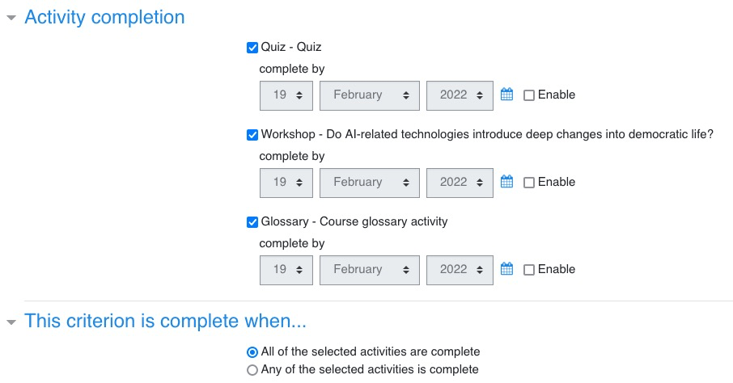
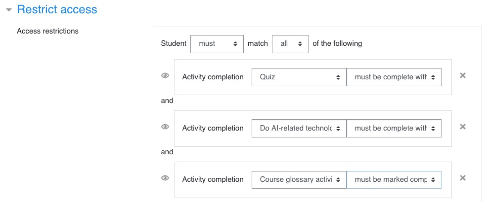

<h1>OBTENTION DU BADGE ET DU CERTIFICAT</h1>

Ce document explique comment paramétrer Moodle afin que les apprenants puissent obtenir leur badge et leur certificat.

[TOC]

# Introduction

Pour obtenir un badge ou un certificat, il faut que les étudiants réunissent certaines conditions (completion) et parfois obtiennent un certain nombre de points (grade). Les conditions à remplir et le nombre de points 

Le terme utilisé dans Moodle pour valider un cours ou une activité est **completion** (activity completion, course completion).

Rappel de certaines notions:

- Les étudiants obtiennent des **notes** ou **marks**, numériques ou non, au niveau de certaines activités. Ces notes sont converties en **points** ou **grades** qui eux sont toujours numériques. 
- Les **points** ou **grades** obtenus pour toutes les activités d'un même cours sont cumulés. 
  - Pour certaines activités, on peut définir (facultativement) un seuil de points en deça duquel l'étudiant échoue à cette activité.
- On peut également définir (facultativement) un seuil de points en deça duquel l'étudiant échoue au cours.
- Certaines activités ne génèrent pas de points (par exemple, ajouter une définition au glossaire).

Il faut aussi garder en tête que lors du fonctionnement du site, l'activité de workshop (essai) va nécessiter de créer régulièrement de nouveaux workshops (le même workshop ne peut pas être utilisé tout au long de la vie du Moodle).

# Points gagnés par activité

Voici la répartition des points gagnés pour chaque activité. J'ai fait en sorte que le nombre de points maximum qu'un étudiant puisse gagner sur le cours soit de **100**.

| Activité               | Max. de points pour l'activité | Min. de points pour valider l'activité |
| ---------------------- | ------------------------------ | -------------------------------------- |
| Essai                  | 50                             | 25                                     |
| - *Rédaction et dépôt* | *40 (80%)*                     | *20*                                   |
| - *Evaluation*         | *10 (20%)*                     | *5*                                    |
| Quiz                   | 50                             | 25                                     |
| Glossaire              | -                              | -                                      |
| **Total**              | **100**                        | **50**                                 |

A noter : Essai et Quiz ont la même importance relative.

Lorsqu'on aura à utiliser le nombre de points minimum pour **valider un cours (course completion)**, il faudra utiliser plus de 50 points (51 par exemple). Sinon, il suffira que l'étudiant réussissent le Quiz pour valider le cours sans avoir à déposer son essai.

# Paramétrage des conditions d'obtention

## Badge

Les conditions d'obtention d'un badge sont définies lors de la création du badge : on choisit ici les activités et on inclut le quiz, l'essai (workshop) et le glossaire comme dans la copie d'écran ci-dessous.

**Attention : Les conditions de réussite de chaque activité doivent avoir été définies au préalable au sein de chaque activité dans la rubrique Activity completion:**

- Quiz : avoir terminé au moins une fois le quiz et avoir obtenu une note suffisante.
- Workshop : avoir au moins soumis l'essai (par forcément les évaluations).
- Glossaire : avoir au moins renseigné 1 entrée.

Note: dans la réalité, on verra plusieurs workshops dans la rubrique Activity completion et il faudra choisir le workshop actuellement en cours (non clôturé).

## Certificat

Le certificat a un fonctionnement différent du badge : il se présente sous la forme d'une **activité** qu'on ajoute à un cours. On n'indique donc pas de condition de réalisation de cette activité (activity completion), mais des **restrictions d'accès** (**restrict access**).

On choisit les activités comme conditions d'obtention du certificat :

  

Note: dans la réalité, on verra plusieurs workshops dans la liste déroulante et il faudra choisir le workshop actuellement en cours (non clôturé).

## Cours

Il est inutile de renseigner les conditions de réalisation du cours (Course completion). Cela ne sert à rien puisqu'on indique déjà les conditions à remplir au niveau du badge et du certificat.

# Scénario en condition réelles

- Imaginons qu'on crée un Workshop 1 : pour pouvoir donner une note à un étudiant dans le Workshop 1, il faut le clôturer ("Closed phase").
- Mais une fois le Workshop 1 clôturé, les nouveaux étudiants ne peuvent plus s'y inscrire. En fait, les étudiants ne peuvent plus s'inscrire au Workshop 1 dès qu'on le passe en phase Assessment, donc bien avant la phase de clôture (les phases sont : submission > assessment > grading > closing).
- Pour qu'il n'y ait pas d'interruption dans le fonctionnement du cours, il faut donc que dès que le Workshop 1 passe à la phase Assessment, on ouvre automatiquement un nouveau Workshop 2 (sinon, il y aura une période de temps pendant laquelle les étudiants ne pourront pas rédiger et soumettre d'essai).
- Dès que le workshop 1 est clôturé (et AVANT que le workshop 2 soit clôturé), il faut introduire le workshop 2 au niveau des conditions d'obtention du badge et du diplôme :
  - Il faut **créer un nouveau badge** en dupliquant le précédant, et ajuster le workshop.
  - Il faut **modifier le certificat** (et non en créer un nouveau) et ajuster le workshop.

