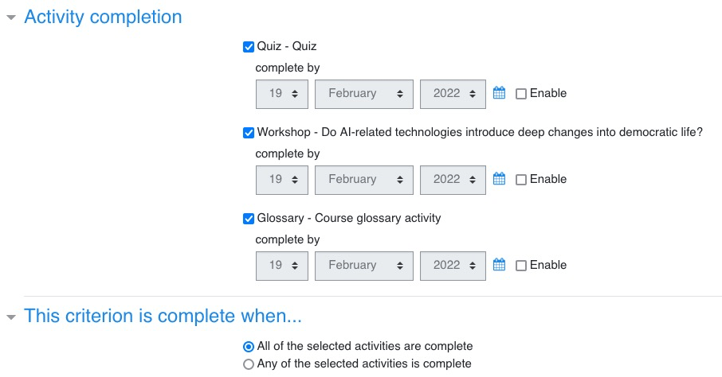
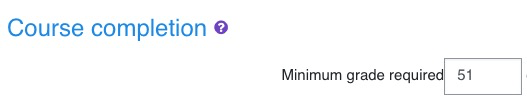

<h1>CONDITION D'OBTENTION DU BADGE ET DU CERTIFICAT DANS MOODLE</h1>

[TOC]

Ce document explique les conditions d'obtention du badge et du certificat dans Moodle et les choix qui ont été faits.

# Conditions d'obtention

En anglais, dans Moodle, c'est le terme ==**completion**== qui est utilisé.

## Obtention du badge

Les conditions d'obtention d'un badge sont définies lors de la création du badge. On a plusieurs possibilités et voici les 2 les plus intéressantes.

### Par activité (pour une ou plusieurs activités)

On peut choisir d'inclure les activités qu'on veut parmi celles présentes dans le cours. On peut donc inclure le quiz, l'essai (workshop) et le glossaire.

Les conditions de chaque activité doivent avoir été définies au sein de chaque activité dans la rubrique Activity completion :

- Quiz : avoir terminé au moins une fois le quiz et avoir obtenu une note suffisante.
- Workshop : avoir au moins soumis l'essai (par forcément les évaluations).
- Glossaire : avoir au moins renseigné 1 entrée.

### Au niveau du cours (course completion)

On indique ici la note minimale pour obtenir le badge. Pour que cela fonctionne, il faut avoir au préalable renseigné les conditions de "completion" au niveau du cours lui-même.

# Conditions

- L'essai (appelé workshop dans Moodle), le quiz et le glossaire sont des activités dans Moodle (activité = l'étudiant interagit avec Moodle - et éventuellement, mais pas nécessairement ses pairs).
- Imaginons qu'on crée un Workshop 1 : pour pouvoir donner une note à un étudiant dans le Workshop 1, il faut le clôturer ("close").
- Mais une fois le Workshop 1 clôturé, les nouveaux étudiants ne peuvent plus s'y inscrire. En fait, les étudiants ne peuvent plus s'inscrire au Workshop 1 dès qu'on le passe en phase Assessment, donc bien avant la phase de clôture (les phases sont : submission > assessment > grading > closing).
- Pour qu'il n'y ait pas d'interruption dans le fonctionnement du cours, il faut donc que dès que le Workshop 1 passe à la phase Assessment, on ouvre automatiquement un nouveau Workshop 2 (sinon, il y aura une période de temps pendant laquelle les étudiants ne pourront pas rédiger et soumettre d'essai).
- Maintenant, pour valider un cours et attribuer un badge et un certificat, il faut :
  - Solution 1 : Soit se baser sur la validation d'activités indiquées **nommément** (Quiz, Workshop **1**, Glossaire)
  - Solution 2: Soit se baser sur une **note globale** : total des notes obtenues, toutes activités confondures, sachant qu'on ne peut attribuer de note au glossaire.*

Chaque solution a ses failles.

**Les failles de la solution 1**

- Un même étudiant peut finalement soumettre plusieurs essais : rien ne lui interdit de soumettre son essai dans le workshop 1, puis le Workshop 2, etc.
- Cette solution impose aussi de créer un nouveau badge et un nouveau certificat dans Moodle pour chaque Workshop car il faut redéfinir à chaque fois les conditions de validation en désignant les Workshops au fur et à mesure de leur création. Cela demande un travail supplémentaire à l'administrateur.
- Un même étudiant peut aussi obtenir plusieurs badges et plusieurs certificats s'il participe aux workshops successifs.

**Les failles de la solution 2**

- Si un étudiant n'a pas assez de points pour obtenir son badge et son certificat, il lui suffit de resoumettre un essai dans un Workshop suivant et à force de cumuler des points, il finira par passer la barre.

**En fait si, mais seulement si une note est attribuée manuellement à au moins une entrée de l'étudiant ce qui oblige soit l'admin soit un autre étudiant à la donner ce qui représente une trop grande contrainte.*

# Les plugins de Moodle

## Badge

Le badge est un plugin **intégré** à Moodle. Le badge est par nature sécurisé (les informations sont encryptées dans l'image du certificat).

## Certificat

Le certificat est un module **ajouté** à Moodle et il est constitué de 2 plugins:

- Création du template de certificat (au niveau système ou catégorie) : https://moodle.org/plugins/tool_certificate

- Emission du certificat : https://moodle.org/plugins/mod_coursecertificate

Il est possible de sécuriser l'obtention d'un certificat à l'aide de plusieurs mécanismes : code, QR code, signature digitale.
La signature digitale se fait à l'aide d'un fichier `.ctr`. Voir https://docs.moodle.org/311/en/Certificate_templates

>  ATTENTION to regenerate a proper certificate when going to production.

# 