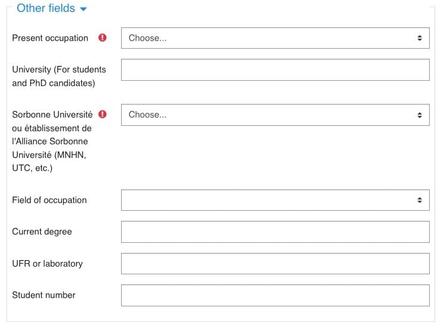

<h1>REGISTRATION FORM</h1>

[TOC]

# Contenu du formulaire d'inscription

Moodle permet d'ajouter des champs personnalisé au formulaire d'inscription.

Cela ne peut se faire que dans la rubrique intitulée "Other fields".

Il suffit de basculer en anglais ou en français pour voir les traductions.
