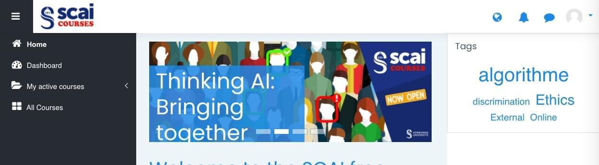
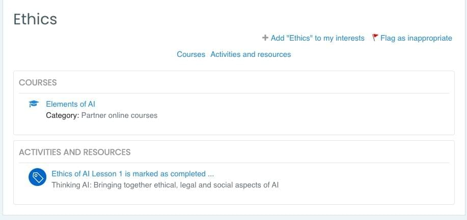
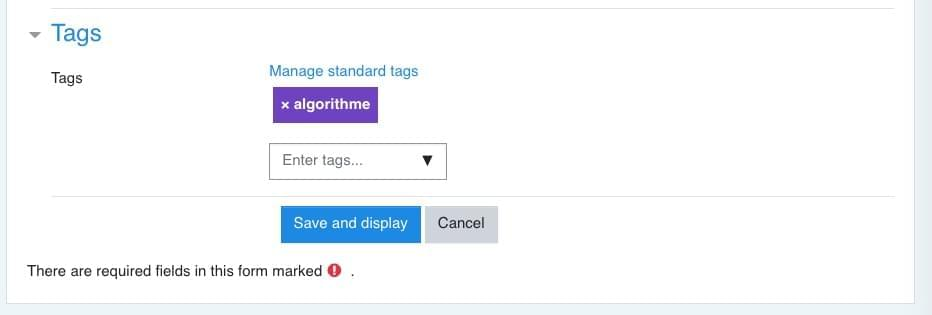

<h1>TAGS</h1>

[TOC]

# Stratégie d'implémentation des tags

Tout d'abord, il faut savoir que les tags peuvent être attribués soit aux leçons d'un cours, soit au cours lui-même. Selon l'endroit où il est attribué, le résultat de la recherche sur un tag particulier ne donnera pas le même résultat.

**Avant d'ajouter des tags dans Moodle, il faut donc soigneusement en préparer une liste en amont et décider où chaque terme sera placé : sur le cours, sur une ou plusieurs leçons, à la fois au niveau cours et au niveau leçon.**

# Première liste de tags

**Programming, Algorithms, Machine Learning, Deep Learning, Statistics, Humanities and Social Sciences, Medicine, Climate and Environment, Data Science, Robotics.**

👉 **TODO**: A compléter et indiquer où ils seront placés.

# Comment se présentent les tags quand on navigue

Les tags sont un instrument puissant de recherche de contenu mais malheureusement la façon dont Moodle les exploite reste limitée.

## Le bloc Tags

L'utilisation de tags se fait grâce à un **bloc** qui apparaît sur un certains nombre de pages à définir selon le paramétrage choisi comme la page d'accueil du. Mais ce bloc ne peut apparaitre que dans une colonne-tiroir à droite de l'écran, mais pas au centre ni à gauche.

On peut faire apparaitre ce bloc aussi **sur les pages des cours** et ajuster les tags en fonction des tags du cours.

**Seul inconvénient, ça diminue l'espace central sur la page, et laisse moins de place au contenu, mais la colonne est rétractable.**

Quand on clique sur un tag, on tombe sur la liste des cours tagués (ici avec le tag Ethics) :

## Page de recherche spécifique

Il existe aussi dans Moodle une page de recherche de tags, mais elle n'apparait dans aucun lien proposé en standard par Moodle. 

Il faut taper son URL manuellement : **https://<url_de_moodle>/tag**  ou **https://<url_de_moodle>/tag/search.php** 

# Les tags dans Moodle

Il y a 2 types de tags, les tags "**standards**" cad officiels, créés par l'admin, et les tags "**libres**" créés par les étudiants dans leur profil.

Les éléments qui nous intéressent et peuvent être tagués sont (mais il y en a bien d'autres) : 

- Les **cours** de façon global (donc par là-même la totalité des leçons)
- Les **activités** comme les **Labels**, mais pas les sections elle-même.

C'est donc uniquement par le biais des activités qu'on va pouvoir taguer les leçons, et ce, **uniquement si elles contiennent un Label.** Ce n'est pas le cas actuellement car certaines leçons se trouvent simplement dans la description de la section. Il va donc falloir faire passer toutes les leçons dans des **Labels.**

## Ajouter un tag dans Moodle

L'ajout de tags "**standards**" se fait par l'**admin** dans une liste de tags. De nouveaux tags peuvent êtres ajoutés par les utilisateurs (étudiants, professeurs) mais il ne deviennent pas automatiquement des tags standards.

## Attribuer un tag à un élément

 Une fois un tags créé, on peut l'ajouter à différents éléments de Moodle :

- à un cours,
- à un label (les leçons sont contenues dans des label, lui-même placé dans une section d'un cours).
- à d'autres activités ou ressources de Moodle, voire à des utilisateurs

Note : on ne peut pas attribuer un tag directement à une section.

# Quelle langue pour les mot-clés ?

Le côté multilingue du site pose problème car il n'existe pas de mécanisme de traduction des mot-clés dans Moodle.

**Il faut donc probablement se limiter aux mots clés en anglais.**

