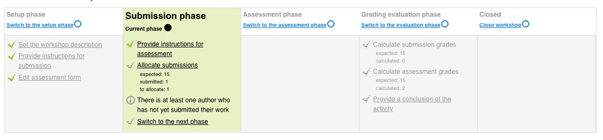
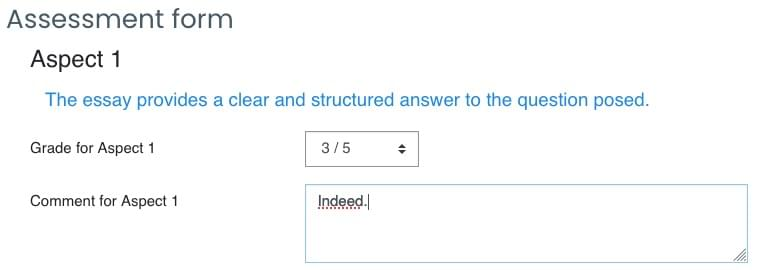
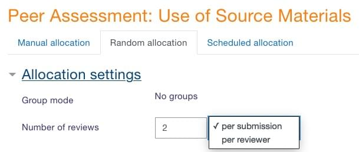
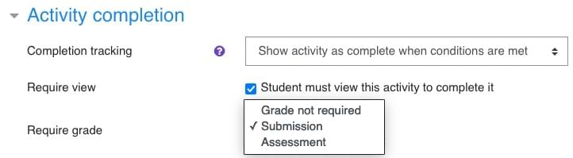
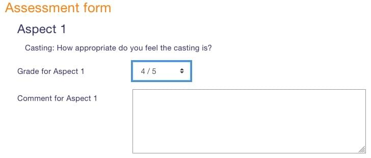
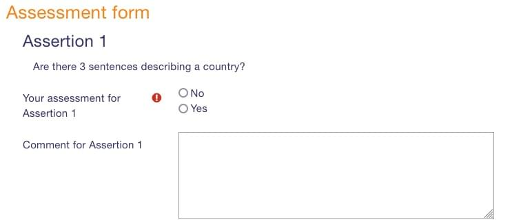
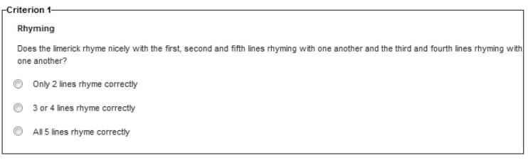

<h1>WORKSHOP (ESSAI)</h1>

[TOC]

# Fonctionnement du Workshop

Le workshop est une activité de Moodle différente des autres par sa mise en oeuvre :

- Elle nécessite un groupe d'apprenant constitué d'au moins 2 personnes.
- Elle doit être limitée dans le temps.
- L'activité doit être clôturée (et ne peut alors plus accueillir de nouveau apprenants) pour que les notes soient délivrées.

Cette activité est très intéressante car elle permet l'interactions entre les apprenants (peer assessement) et demande un effort de réflexion intéressant de la part des apprenants.

Mais elle n'a donc pas été conçue pour l'usage que souhaite en faire SCAI qui consiste à ouvrir le site à des individus séparés qui vont se présenter de façon aléatoire sur le site pendant toute la durée de vie de la plateforme.

Il va donc falloir biaiser avec le système en créant successivement plusieurs workshops.

Le workshop est consitué de **5 phases successives** : **Setup, Submission, Assessment, Grading, Closed**.

- Les apprenants déposer leur essai que dans la phase de Submission. 
- Les notes ne sont délivrées aux apprenants que lorsque le workshop est en phase **Closed**.

# Paramétrage choisi

- L'essai se soumet en ligne uniquement dans une **zone de saisie** (il pourrait à la place ou en plus se faire par un document Word/PDF/audio/vidéo qu'on uploade).

- La soumission de l'essai n'est plus possible une fois qu'on est passé en phase Assessment. Cela serait possible mais présente des ínconvénients :  

  - L'étudiant n'a pas la possibilité de modifier son essai s'il est en retard.

  - Cela oblige l'admin à revenir manuellement sur l'attribution des évaluateurs des essais en retard.

- J'indique une nombre minimal de 500 mots pour l'essai, mais on n'a aucun moyen de le vérifier automatiquement.
- Je n'autorise pas l'étudiant à évaluer son propre travail (ce serait possible sans que cela soit systématique).
- Je donne un maximum de **50 points** à l'essai (ainsi, combiné avec les 50 points du quiz, on obtient un maximum de 100).

## Sujet de l'essai

Un workshop fonctionne dans une période temps limitée. Il faut le recréer plusieurs fois de suite tout au long de la vie du site, en fonction de l'affluence sur le site ou selon un période prédéfinie (1 mois, par exemple).

Le premier sujet est :

**Do AI-related technologies introduce deep changes into democratic life? Or that abstention or populist voting is the result of the evolution of modern states, independently of technological developments?**

## Questions pour l'évaluation de l'essai

L'évaluation se fait sous forme de **questions** auxquelles l'évaluateur (le peer) répond. Il faut au moins une question, mais de préférence plusieurs (autant qu'on veut). Chaque question peut avoir un poids relatif différent. Voici les questions et leur poids respectif.

| Questions                                                    | Poids |
| ------------------------------------------------------------ | :---: |
| The essay provides a clear and structured answer to the question posed |   2   |
| The essay references one or more courses in the Thinking AI program |   1   |
| The essay provides a critical view of the question posed (opposing or complementary views) |   1   |

## Stratégie d'évaluation (grading strategy)

Le type d'évaluation retenue est **Accumulative grading**: la note est obligatoire et le commentaires facultatif. J'ai choisi la possibilité de donner une **note de 0 à 5**.

## Répartition du poids entre note de dépôt (submission) et note d'évaluation (assessment)

Le nombre max. de poids pour l'essai est **50**. L'étudiant reçoit 2 notes :

1. Une note pour **la qualité de son essai** (le dépôt / submission phase) calculée en fonction des notes reçues par les pairs -> **poids donné de 80%** (40 points).
2. Une note **pour la qualité de l'évaluation** (assessment phase) de ses pairs calculée par l'IA (!) de Moodle -> **poids donné de 20%** (10 points).

## Note minimale pour valider l'activité Essai + Evaluation

- 20 points au minimum sont nécessaires pour valider l'essai.
- 5 points au minimum sont nécessaires pour valider l'évaluation des pairs.

## Choix du nombre d'évaluations

Moodle permet d'indiquer le nombre d'évaluateur pour chaque essai OU le nombre d'évaluations pour chaque essai (mais pas les 2). Ce choix se fait par l'admin dans la phase d'assessment, au moment où l'admin décide qui va évaluer quel essai.

**On choisit d'indiquer 2 évaluations par essai : 2 reviews per submissions** **(un nombre impair serait mieux).**

C'est ensuite Moodle qui calcule :

- La note donnée à l'essai
- La note donnée à chaque étudiant pour la qualité de ses évaluations

Remarque : Moodle évalue la peer review avec une petite IA qui préfère avoir un nombre impair de reviewer (3, 5...), car ça permet de trancher les cas ambigus. Le résultat de la qualité des évaluations sera meilleure si chaque essai est revu un nombre impair de fois.

# Bug Moodle

Dans le paramétrage "Activity completion", on a le choix de valider l'activité par l'attribution d'une note pour l'"assessment" ou la "submission". 

**ATTENTION: dans la version 3.11 de Moodle, si on choisit Assessment, ça bugue : l'activité n'est jamais validée (d'où le choix de Submission).**

On est donc obligé de choisir Submission. Un essai pourra donc être considéré comme terminé même s'il n'a pas été évalué.

# Description de certains paramétres

## Stratégie d'évaluation (grading strategy)

Les questions servant à l'évaluation de l'essai peuvent donner lieu à différents types de réponses :

- **Comments: Simple commentaires** tous obligatoires (pas de note donnée)
- **Accumulative grading: Notes \* ou échelle \**** (obligatoires) et commentaires (facultatifs)
- **Number of errors: Réponse booléene** (ou/non, vrai/faux, blanc/noir - on met ce qu'on veut)
- **Rubric: Réponses multiples** sous forme de boutons radio. Chaque réponse a une valeur de 0 à 100.

\* Les notes peuvent prendre la forme : de 1 à x (x = 10, 20, 100 - ce qu'on veut)

** Les échelles sont de la forme : compétent/non compétent - Mauvais, Moyen, Bon - A, B, C… - on peut définir ce qu'on veut

### **Exemples de types de réponses**

- Accumulative grading:

- Number of Errors:

- Rubric:

# Resources

## Tutos Moodle

- Tuto "Workshop, peer assessment": https://youtu.be/7cYG1d87jSo
- Tuto "Activity completion": https://youtu.be/ySPPj7uU5P8

## Docs Moodle

- https://docs.moodle.org/311/en/Workshop_settings
- https://docs.moodle.org/311/en/Using_Workshop
- https://docs.moodle.org/311/en/Workshop_grading_strategies
- https://moodle.org/mod/forum/discuss.php?d=227438

## Démos en ligne pour tester des workshops

Pour se faire la main, un Moodle de démo avec des exemples se trouve en ligne : https://school.moodledemo.net

Il est remis à zéro toutes les heures. Voici des liens directs vers des workshops de certains cours donnés en exemple. On peut se connecter en tant que (login / pwd) : 

- manager / moodle
- teacher / moodle
- student / moodle

Examples de cours avec des workshops : [Celebrating culture](https://school.moodledemo.net/mod/workshop/view.php?id=651), [History: Russia in Revolution](https://school.moodledemo.net/mod/workshop/view.php?id=575), [Digital Literacy](https://school.moodledemo.net/mod/workshop/view.php?id=803)
