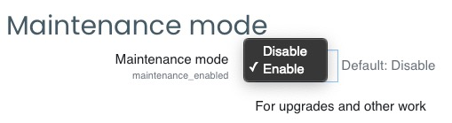
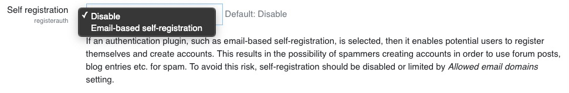
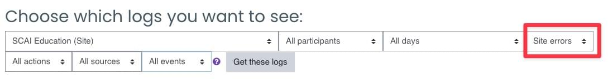

<h1>MAINTENANCE</h1>

[TOC]

# Checking for new versions

New versions of Moodle and of the plugins will be released from time to time.

►See [install_git.md](manuals/install_git.md) document to upgrade Moodle.

*Paragraph to complete.*

# Maintenance mode

Maintenance mode is for preventing any users other than administrators from using the site while maintenance is taking place, though *it's not designed to prevent user access during version upgrades*.

Go to `Administration > Server > Maintenance mode`  and set **Maintenance mode** (maintenance_enabled) to Enable.

For more see: https://docs.moodle.org/311/en/Maintenance_mode

# Pause the cron

Cron should normally be enabled, however this setting allows it to be disabled temporarily, for example before a server restart. If disabled, the system is prevented from starting new background tasks. Note that the cron should not be disabled for a long time, as this will prevent important functionality from working.

Go to  `Administration > Server > Tasks > Task processing`  and uncheck **Enable cron** (cron_enabled).

# Pause registration

This mode is not a maintenance mode strictly speaking and in this mode, already registered users (students, teachers, admins...) can still access the Moodle and keep working. But new users can't register anymore.

Go to Site `Administration > Plugins > Authentication > Manage authentication`, and set **Self registration** (registerauth) to disable.

To resume registration, choose *Email-based self-registration*.

# Purge the caches

Go to Site `Administration > Development > Purge all the caches`, and click **Purge the caches**.

There is no danger in purging caches, but your site may appear slower for a while until the server and clients calculate new information (themes, javascript, language strings, filtered text...) and cache it.

It is also possible to delete directly the content of some folders in the moodledata folder but this method has to be used with much caution.

# Logs

To check the logs and search for errors, go to `Administration > Reports > Logs`. 

**<u>Settings</u>**:

Logs are currently saved during 180 days.

This can be adjusted at `Administration > Plugins > Logging > Standard Log`.

If the database has grown excessively, it's maybe time to shrink the log as explained here: https://www.elearningworld.org/excessive-moodle-lms-logs-part-1/
