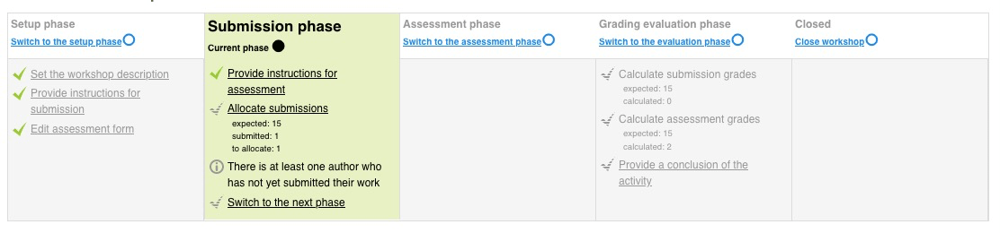

<h1>WORKSHOP (ESSAI)</h1>

[TOC]

# Les contraintes

Le workshop est une activité de Moodle différente des autres par sa mise en oeuvre :

- Elle nécessite un groupe d'apprenant constitué d'au moins 2 personnes.
- Elle doit être limitée dans le temps.
- L'activité doit être clôturée (et ne peut alors plus accueillir de nouveau apprenants) pour que les notes soient délivrées.

Cette activité est très intéressante car elle permet l'interactions entre les apprenants (peer assessement) et demande un effort de réflexion intéressant de la part des apprenants.

Mais elle n'a donc pas été conçue pour l'usage que souhaite en faire SCAI qui consiste à ouvrir le site à des individus séparés qui vont se présenter de façon aléatoire sur le site pendant toute la durée de vie de la plateforme.

Il va donc falloir ruser avec le système en créant successivement plusieurs workshops.

Le workshop est consitué de **5 phases successives** : **Setup, Submission, Assessment, Grading, Closed**.

- Les apprenants ne déposent leur essai que dans la phase **Submission**. 
- Les notes ne sont délivrées aux apprenants que lorsque le workshop est en phase **Closed**.

# Schéma de déroulement

Voilà un schéma de déroulement lorsqu'il y a plusieurs workshop en cours.

```mermaid
gantt
    title Sequencing of workshops phases
    %% this is a comment
    dateFormat  D
    axisFormat %d/%m
	todayMarker off
	section Workshop 1
	    Submission :a1, after a0, 3d
    	Assessment (active) :active, crit, a2, after a1, 2d
    	Grading :after a2, 1d
    section Workshop 2
	    Submission (active) :crit, b1, after a1, 4d
    	Assessment :b2, after b1, 2d
    	Grading :after b2, 1d

```

Dans cet exemple. les phases actives (avec du rouge) sont celles dans lesquelles on se trouve : 

- Workshop 1 : on est en phase d'évaluation (assessment)
- Workshop 2 : on est en phase de dépôt de l'essai ()

# Règle de fonctionnement

S'il n'y a qu'une seule chose à retenir : **il doit toujours y avoir un workshop en phase de soumission à tout moment.**

# Pas à pas

