<h1>WORKSHOP (ESSAI)</h1>

[TOC]

# Les contraintes

Cette activité est très intéressante car elle combine interaction entre les apprenants (peer assessement) et effort de réflexion. Mais elle n'a pas été conçue pour l'usage que souhaite en faire SCAI qui consiste à ouvrir le site à des individus séparés qui vont se présenter de façon aléatoire sur le site pendant toute la durée de vie de la plateforme. Il va donc falloir s'adapter au fonctionnement du workshop.

Le workshop est consitué de **5 phases successives** : **Setup, Submission, Assessment, Grading, Closed**. C'est une activité qui possède de nombreuses contraintes :

- Elle nécessite un **groupe d'apprenants** constitué d'au moins <u>2 personnes</u>.
- Elle doit être **limitée dans le temps**.
- Les apprenants ne peuvent déposer leur essai que dans la phase **Submission**. 
- Les notes ne sont délivrées aux apprenants que lorsque le workshop est en phase **Closed**.

# Schéma de déroulement

Voilà un schéma de déroulement lorsqu'il y a plusieurs workshop en cours.

```mermaid
gantt
    title Sequence of workshop stages
    %% this is a comment
    dateFormat  D
    axisFormat %d/%m
   	todayMarker off
    We are here : milestone, crit, after a1    
   section Workshop 1
     Submission : done, a1, after a0, 3w
     Assessment (active) :active, crit, a2, after a1, 2w
     Grading :a3, after a2, 1w
     Closed :after a3, 5w
  section Workshop 2
    Submission (active) :active, crit, b1, after a1, 4w
    Assessment :b2, after b1, 2w
    Grading :b3, after b2, 1w
    Closed :after b3, 1w
  section Workshop 3
    Submission:c1, after b1, 4w
```
Pour l'exemple, plaçons-nous à un moment où les phases actives sont celles indiquées en rouge : 

- **Workshop 1** : on termine juste la phase de dépôt de l'essai (submission) et on commence la phase d'évaluation (assessment)
- **Workshop 2** : on démarre la phase de dépôt de l'essai (submission)
- **Workshop 3** : n'a pas encore commencé

# Règle de fonctionnement

S'il n'y a qu'une seule chose à retenir : **il doit toujours y avoir un workshop en phase de soumission à tout moment.**

Donc dès qu'on bascule le workshop en cours en phase d'assessment, on doit automatiquement en créer un nouveau qu'on passe en phase de submission.

# Pas à pas

Ce chapitre va indiquer les différentes étapes de déroulement d'un workshop.

**On commence au moment où le workshop 1 (en cours) vient de passer de la phase Submission à la phase Assessment.**

## Créer un nouveau workshop (workshop 2)

Au lieu de créer un workshop de zéro, on duplique un des workshop existants.

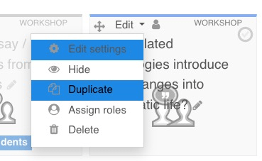

On click sur **Edit settings**  pour ajuster les informations :

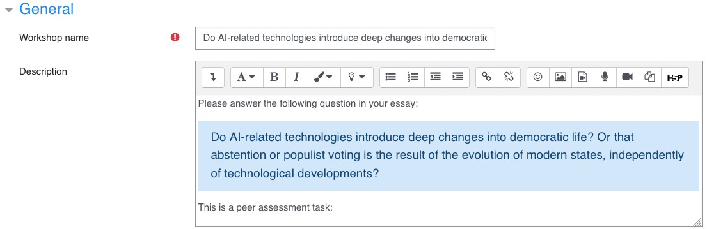

Il faut aussi changer les **Instructions for submission** et on clique sur le bouton **Save and display**.

II faut s'assurer que ce nouveau workshop soit bien en phase de Submission (ce ne devrait pas être le cas) en cliquant sur **Switch to the submission phase**.

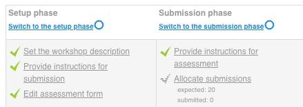

On a désormais 2 workshops actifs : 

- Le workshop précédent (**workshop 1**) miantenant en phase Assessment.
- Le workshop qu'on vient de créer (**workshop 2**) en phase Submission.

## Créer un nouveau badge pour le workshop 2

Il faut maintenant créer un nouveau badge. Comme pour le workshop on va dupliquer un badge existant.

- Au niveau du cours, aller dans **Manage badges** et cliquer sur l'icone de duplication  d'un des badges existants. 

- Sauvegarder le badge nouvellement créé sans rien changer puis aller dans **Criteria**.

- Cliquer sur l'icone  pour supprimer les critères existants.

- Sélectionner **Activity completion** pour ajouter les nouveau critères.
  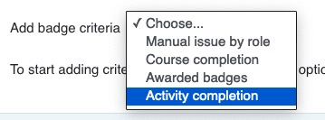

- L'ensemble des activité du cours apparaissent. Cliquer sur :

  - Quiz
  - Glossary
  - Le workshop nouvellement créé (et UNIQUEMENT celui-ci)

  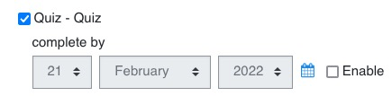

- Ajuster la rubrique suivante (This criterion....) pour choisir **All of the selected activities are complete** et cliquer sur **Save**.

  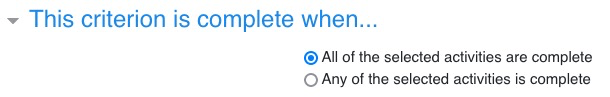

- Activer le badge en cliquant sur **Enable access**.
  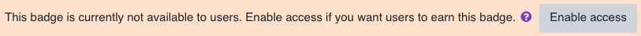

Le badge est maintenant créé et actif comme on peut le voir dans la liste des badges.


## On attend que le workshop 1 soit clôturé

Ne PAS modifier le certificat maintenant. On attend. On attend patiemment... ☕️ ⏰ Et voilà le workshop 1 est maintenant terminé !

## On modifie le certificat

Pour le certificat, on procède différemment : on ne le duplique pas, **on le modifie**. Mais il ne faut pas le modifier tant que le **workshop 1** n'est plas clôturé. Il faut donc attendre et laisser les étudiants terminer le **workshop 1** avant de poursuivre.

Maintenant que le workshop 1 est terminé : 

- On va dans la **section Introduction** du cours pour modifier le certificat.

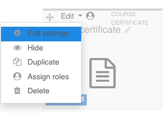

- On se rends dans **Restrict access**.

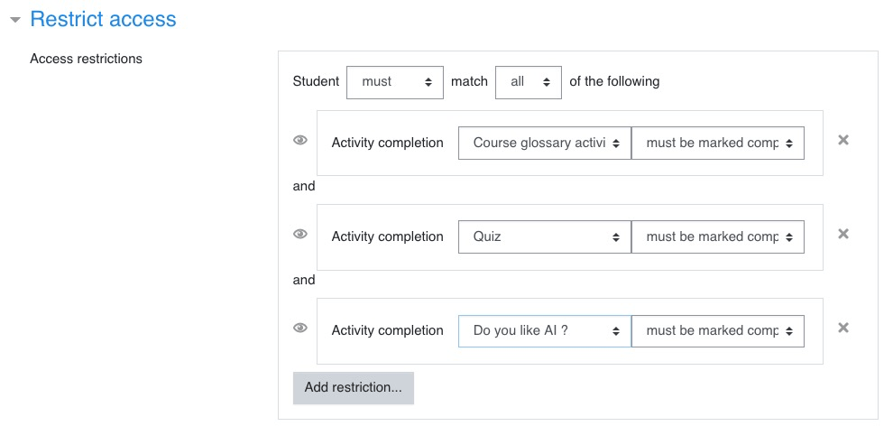

- On ajuste l'activité correspondant au workshop pour **remplacer le workshop 1 par le workshop 2**.
- On Sauvegarde.

## Passer le workshop 2 en phase Assessment

Le temps a passé, les étudiants ont eu le temps de soumettre leurs essais, on peut passer à la phase suivante.

- Se rendre dans la section **Activity: Write an essay & assess peers**.
- Ouvrir le workshop 2 en cliquant sur son nom (Do you like AI? dans cet exemple)
  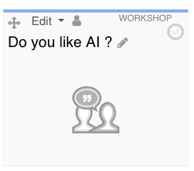

- Regarder en bas de page si suffisamment d'étudiants ont soumis leur essai (au moins 2).
- Si c'est le cas, cliquer sur **Switch to the assessment phase**.
  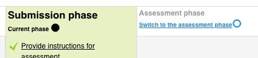

- On doit voir ceci :
  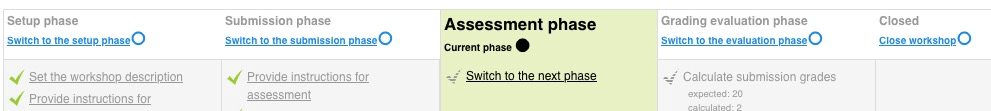

Il faut maintenant assigner les essais à évaluer aux étudiants (ce n'est pas automatique).

- Il faut cliquer sur le lien Allocate Submissions au niveau de la roue dentée.
  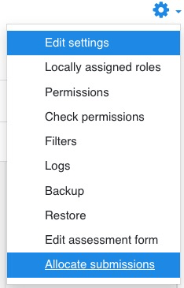

- Cliquer ensuite sur **Random allocation**
- Ajuster la rubrique **Number of reviews** comme ceci :
  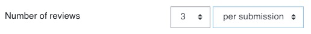
  Le nombre peut être ajusté en fonction du nombre d'étudiants qui ont soumis leur essai.

- Sauvegarder et cliquer sur **Manual allocation** pour voir le détail des allocations et s'assurer que tout s'est bien passé.
- La phase d'assessement est maintenant démarrée

## Créer un workshop 3

Ne pas oublier que quand on passe un workshop en phase Assessment, il faut en créer un nouveau !!

## Passer le workshop 2 en phase grading

Le temps a passé, les étudiants ont eu le temps d'évaluer leurs pairs, on peut passer à la phase suivante.

- On clique sur **Switch to the evaluation phase**.
  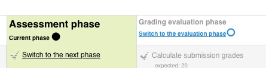

- Dans la section **Grading evaluation settings**, on indique **Fair** dans la liste déroulante et on clique sur le bouton **Re-calculate grades**.
- On s'assure dans la liste en-dessous que les points ont bien été attribués à tous les étudiants
  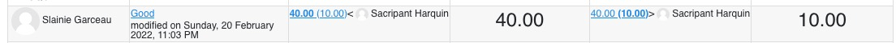
  Dans l'exemple au-dessus, l'étudiant a reçu le maximum de points (40 et 10).

## Clôturer le workshop 2

Cette dernière phase est essentielle : elle officialise les notes indiquées dans la phase précédente.

Si on ne clôture pas le workshop, les étudiants ne recevront jamais leur badge et leur diplôme.
